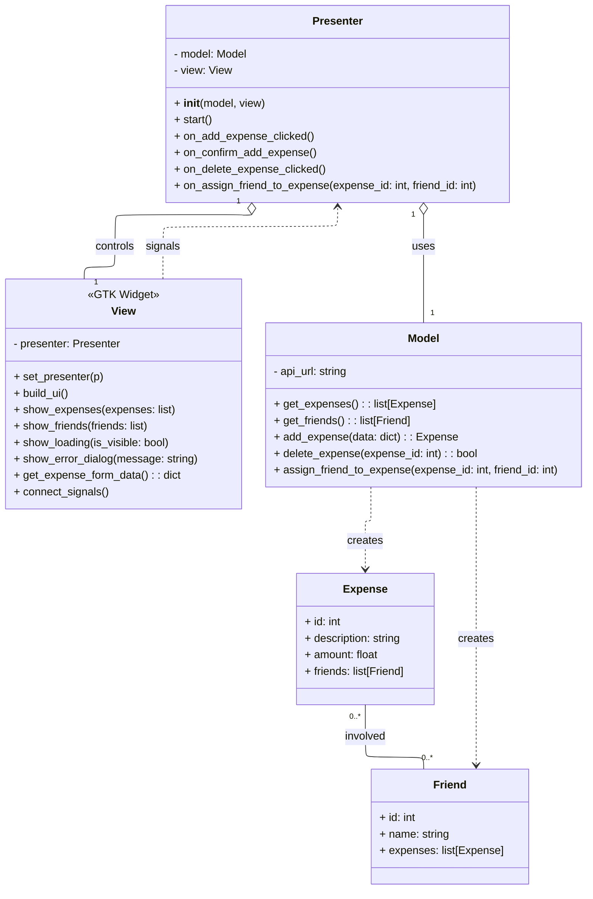
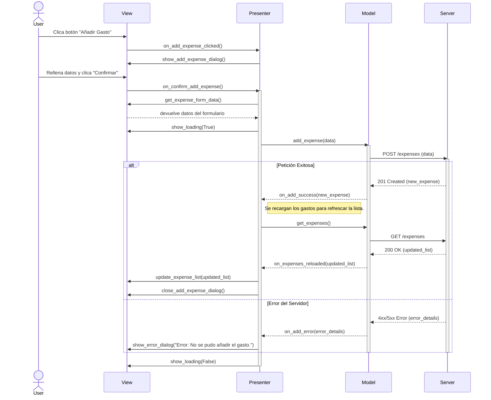

# Diseño de Software: SplitWithMe

## 1. Patrón Arquitectónico: Model-View-Presenter (MVP)

Para esta aplicación hemos optado por el patrón **Model-View-Presenter (MVP)**. Lo elegimos porque nos permite separar la lógica de la aplicación de la interfaz de usuario, lo que hace que las interfaces sean más simples y el código mucho más fácil de mantener.

### Justificación de la elección del patrón MVP

1. **Separación de responsabilidades**: MVP divide la aplicación en tres capas:
    * La **Vista** se encarga solo de mostrar datos y capturar las acciones del usuario. No toma decisiones ni maneja lógica del programa, así que está totalmente desacoplada del modelo.
    * El **Modelo** gestiona toda la información y se comunica con el servidor. No sabe nada de cómo se muestran los datos en pantalla.
    * El **Presentador** hace de intermediario: recibe las acciones de la Vista, solicita datos al Modelo y luego actualiza la Vista. Así, Vista y Modelo no dependen directamente entre sí.

2. **Se adapta a nuestro entorno**:
    * **Python**: el patrón encaja muy bien con la programación orientada a objetos que usamos.
    * **GTK 4**: perfecto para librerías de GUI basadas en eventos. La Vista emite señales que el Presentador captura y procesa.
    * **Facilidad para pruebas**: como la lógica está separada en Presentador y Modelo, podemos hacer tests unitarios fácilmente sin tener que abrir la interfaz gráfica.

### Qué hace cada componente

* **Modelo (`model.py`)**: Se encarga de las llamadas a la API, convierte los datos en objetos de Python y maneja toda la lógica de acceso a datos.
* **Vista (`view.py`)**: Construye la interfaz con GTK 4, muestra los datos que recibe del Presentador y le avisa cuando el usuario hace algo (por ejemplo, clic en un botón).
* **Presentador (`presenter.py`)**: Recibe las acciones de la Vista, pide los datos al Modelo, los procesa si hace falta y luego actualiza la Vista.

---

## 2. Diseño Estático (Diagrama de Clases)

El siguiente diagrama UML muestra las clases principales de la aplicación y cómo se relacionan entre sí dentro de la arquitectura MVP.

---

## 3. Diseño Dinámico (Diagramas de Secuencia)

Estos diagramas ilustran la colaboración entre los objetos para llevar a cabo los casos de uso principales. En esta fase inicial, las operaciones se modelan de forma síncrona.
1️⃣ Añadir un Gasto

Objetivo: Mostrar cómo el usuario ingresa los datos de un gasto, se asignan amigos y se guarda en el servidor.

